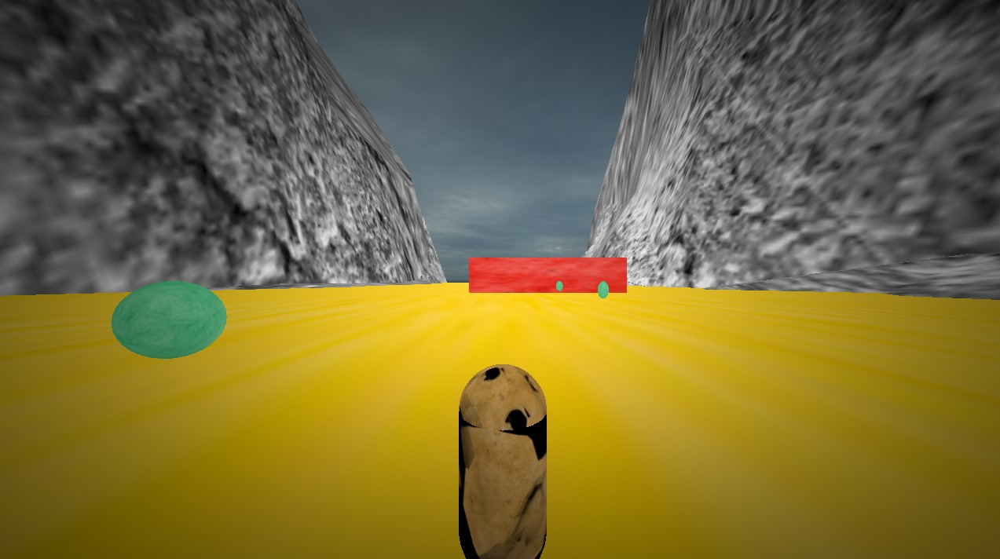

# Coin Warrior

## Table of Contents
- [Description](#builtwith)
- [Requirements](#requirements)
- [How to run](#run)
- [How to play](#play)
- [Built with](#builtwith)
- [Screenshots](#screenshots)

## Description 
[(return to top)](#coin-warrior)

Coin Warrior is a game where you must collect the required number of coin to win. You also should avoid colliding with the red barriers.

## Requirements 
[(return to top)](#coin-warrior)

- Microsoft Visual Studio Code
- Graphics card supporting OpenGL 3.3+
- CMake 3.0+ (preferably the VS Code extension)

## How to run
[(return to top)](#coin-warrior)

- Clone or download the project
- Open the project folder `phase-02` in VS Code and build the project
- Open the terminal and run the following command:
    -   `./bin/GAME_APPLICATION.exe -c='config/app-final.jsonc'`

## How to play
[(return to top)](#coin-warrior)

- **W and S** to move forward and backward
- **A and D** to move left and right
- **Esc** to exit to the main menu

## Built With 
[(return to top)](#coin-warrior)

- OpenGL 3.3
- C++

## Screenshots 
[(return to top)](#coin-warrior)

### Main menu:

### Inside the game:

### Win menu:

### Lose menu:
